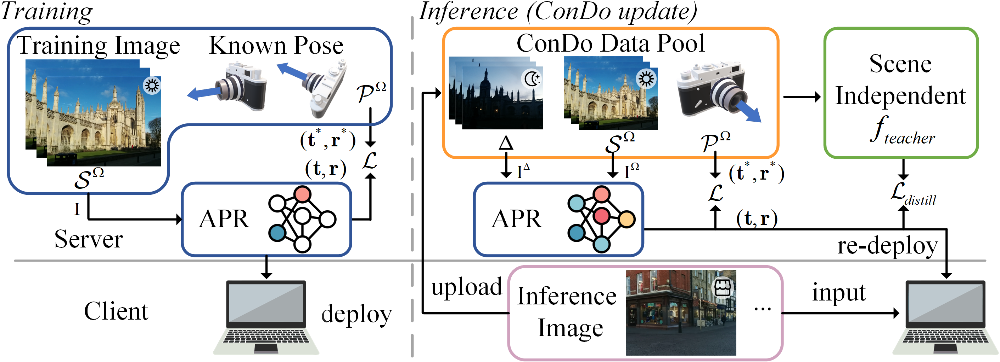

<h2 align="center">ConDo: Continual Domain Expansion for Absolute Pose Regression</h2>

<div align="center">
<a href="https://arxiv.org/abs/2412.13452"></a>
<a href="https://aaai.org/conference/aaai/aaai-25/"></a>
<a href="https://en.xmu.edu.cn"></a>
<a href="https://www.intel.com"></a>
</div>

<h2>Abstract</h2>
Visual localization is a fundamental machine learning problem. Absolute Pose Regression (APR) trains a scene-dependent model to efficiently map an input image to the camera pose in a pre-defined scene. However, many applications have continually changing environments, where inference data at novel poses or scene conditions (weather, geometry) appear after deployment. Training APR on a fixed dataset leads to overfitting, making it fail catastrophically on challenging novel data. This work proposes Continual Domain Expansion (ConDo), which continually collects unlabeled inference data to update the deployed APR. Instead of applying standard unsupervised domain adaptation methods which are ineffective for APR, ConDo effectively learns from unlabeled data by distilling knowledge from scene-agnostic localization methods. By sampling data uniformly from historical and newly collected data, ConDo can effectively expand the generalization domain of APR. Large-scale benchmarks with various scene types are constructed to evaluate models under practical (long-term) data changes. ConDo consistently and significantly outperforms baselines across architectures, scene types, and data changes. On challenging scenes (Fig.~\ref{Fig-teaser}), it reduces the localization error by >7x (14.8m vs 1.7m). Analysis shows the robustness of ConDo against compute budgets, replay buffer sizes and teacher prediction noise. Comparing to model re-training, ConDo achieves similar performance up to 25x faster. 

<div align="center">
    
	</a>
</div>
<p></p>

## 📌 Citation

If ConDo contributes to your research, we kindly request that you cite our work. Additionally, if you find this repository helpful and appreciate our efforts, we would be grateful if you could give a ⭐️ to support this work.
```bibtex
@misc{li2024condocontinualdomainexpansion,
      title={ConDo: Continual Domain Expansion for Absolute Pose Regression}, 
      author={Zijun Li and Zhipeng Cai and Bochun Yang and Xuelun Shen and Siqi Shen and Xiaoliang Fan and Michael Paulitsch and Cheng Wang},
      year={2024},
      eprint={2412.13452},
      archivePrefix={arXiv},
      primaryClass={cs.CV},
      url={https://arxiv.org/abs/2412.13452}, 
}
```
